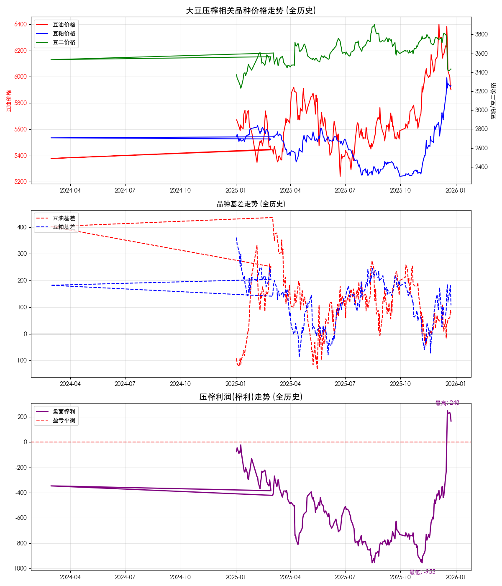
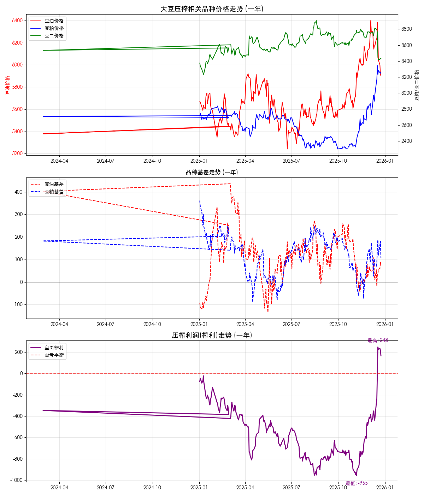
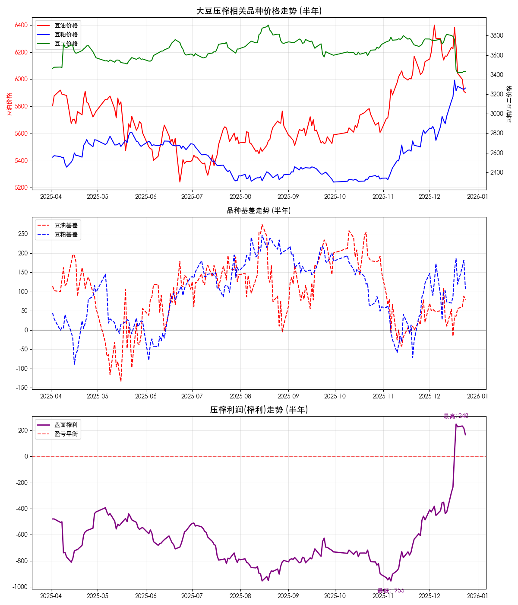

## 🛰️ 核心摘要

截至 **2025-12-24**，盘面数据概览：

- **当前榨利**: `166.75` 元/吨
- **近半年平均**: `-644.91` 元/吨
- **近半年胜率**: `3.3%`
- **豆油基差**: `78` | **豆粕基差**: `107`

---

## 📈 走势可视化

### 1. 全历史走势
这是基于所有获取到的数据生成的长周期走势图。

### 2. 近两年细节
聚焦于近两年的市场波动。

### 3. 近一年细节
展现年度季节性与趋势。

### 4. 近半年精细分析
最高精度的近期走势分析。

---

## 🔍 指标解读

### 榨利计算公式
> 榨利 = (豆油现货价格 × 18.5% + 豆粕现货价格 × 78.5%) - 豆二价格 - 压榨成本
> *注：现货价格 = 期货价格 + 基差。压榨成本设定为 150.0 元/吨。*

### 当前位置评估
当前榨利为 **166.75** 元/吨，较半年均值 **偏高**。
从基差来看，豆油基差处于 `78`，豆粕基差处于 `107`，对榨利贡献分别为 ...

---

> 数据自动更新于: 2025-12-24 21:59:12
> 数据源：交易法门(基差) / 新浪财经(期货)
